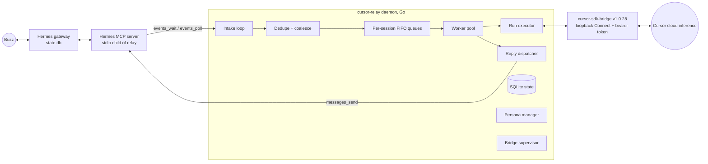
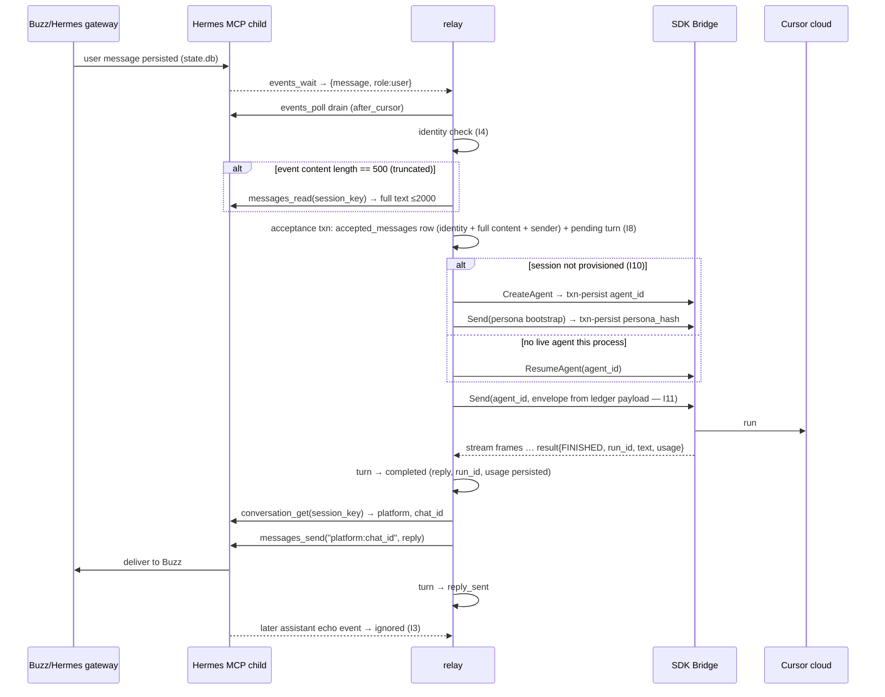

# Hermes Social Agent on Buzz — Architecture Specification

Status: FINAL, revision 2 (review rounds 1–2 complete; post-disposition blocker corrections integrated) · Owner: `SocialArchitect` · Reviewer: `ArchitectureReviewer` · 2026-08-14
Journal copy: `.journal/001/ARCHITECTURE.md`. Final reviewer disposition: **APPROVE**.

> **Second-spike correction required:** The 2026-08-14 failure spike invalidated the gateway-only Hermes assumption in R1 and refined the F5 recovery path. Do not implement this revision unchanged. See `NOTES.md`, “Second SDK failure spike completed,” for observed results pending an architecture revision.

Evidence base: spike branch `spike/cursor-sdk-hermes` (`spike/main.go`, `spike/bridge.go`, `spike/social.go`), Hermes clone `mcp_serve.py` (EventBridge and MCP tools), journal session 001 (spike verification, transport decision history, economics decision), Cursor SDK Bridge v1.0.28 live behavior observed by the spike.

## 1. Context and non-goals

### 1.1 Goal

An always-on social agent (the **relay**) that answers messages on Buzz. Hermes is the messaging gateway: it owns Buzz connectivity, transcript persistence (`state.db`), and message delivery. The Cursor SDK Agent is the **only** reasoning loop: each Hermes `session_key` maps to exactly one durable Cursor agent whose runs consume the owning user's Cursor subscription through the SDK Bridge local runtime on the same always-on host. Inference is Cursor-hosted.

Spike-verified foundations: one tool-free local agent per session; conversational memory across bridge and relay restarts via `ResumeAgent`; assistant events produced no response; run IDs, durations, and token usage returned per run. The observed ~3.3–3.7k input-token overhead per social turn is capacity/latency data, not a cost rejection criterion (user-confirmed ≥ ~20× subscription economics).

### 1.2 Non-goals

- OpenAI/Anthropic compatibility APIs, ACP transport, coding-agent features, admin UI.
- Generic provider/framework abstractions. This is a single-purpose relay.
- Direct Buzz API usage or design. All Buzz traffic flows through Hermes's MCP boundary; no Buzz API shapes are assumed.
- Billing platform or multi-tenant key vault. Tenancy is process-level (§11.1).
- Social tool callbacks for the Cursor agent. Phase 1 ships a tool-free agent; §3.3 fixes only the boundary where tools would later attach.

## 2. System overview



One relay process owns exactly: one Hermes MCP child (stdio), one SDK Bridge child (loopback), one SQLite state file, one isolated workspace, one bridge state-root, one Cursor user API key. Hermes never calls Cursor; the relay never touches Buzz; the Cursor agent is never nested under any Hermes model/tool loop.

## 3. Component responsibilities and boundaries

### 3.1 cursor-relay daemon (new, single Go binary)

| Part | Responsibility | Must not |
|---|---|---|
| Bridge supervisor | Verify pinned bridge binary SHA-256, launch with `--workspace`/`--state-root`, validate ready-line discovery (§11.3), hold bearer token in memory, restart with backoff, graceful shutdown | log token or API key; accept `schemaVersion != 1`; accept non-loopback discovery URL |
| Hermes MCP client | Spawn and supervise the Hermes MCP stdio child; call only the tools in §4.1; restart with backoff; run the generation-change protocol (§6.3) | assume event cursors survive the child |
| Intake loop | `events_wait` long-poll, then `events_poll` drain; forward message events | interpret non-message events (approval events are Hermes-internal) |
| Dedupe + coalesce | Enforce message-identity idempotency (I4), persist identity **and normalized payload** at acceptance (I8), batch into turns (§7.2) | create turns for `role != "user"` (I3); drop or age-prune an accepted identity |
| Per-session queue + worker pool | Serialize per session (I2), bound global concurrency (default 1 worker, §7.1), gate execution on completed provisioning (I10) | cancel an in-flight run because a new message arrived; execute before bootstrap commits |
| Run executor | `CreateAgent`/`ResumeAgent`/`Send`/cancel via generated `sdk.v1` client; build envelopes from ledger payload only; persist `run_id` at first sight; classify terminal status | rerun an indeterminate `Send` into the same agent (§9, F5); re-read Hermes at run time; retry unboundedly |
| Reply dispatcher | Resolve `session_key → target` immediately before each send via `conversation_get`, `messages_send` with bounded retry, mark `reply_sent` | send anything not originating from a `completed` turn (I5); cache targets across sends |
| Persona manager | Render persona bundle, run the provisioning sequence (§10.2), persona updates, rotation with memory handoff (§10.4) | re-send persona on every turn |
| State store | SQLite ledger (§5) with WAL, migrations, payload-only retention pruning (§7.2) | store the API key or bridge token; age-prune identity rows |

### 3.2 Existing components (unchanged)

- **Hermes gateway**: Buzz connectivity, transcripts, delivery. Must be deployed gateway-only for the Buzz sessions the relay serves — its own model loop must not also answer them (risk R1, §15). Its deployment must include outage/backlog monitoring (§6.4, R7).
- **Hermes MCP server** (`mcp_serve.py`): the only integration surface; contract in §4.1. Launched as the relay's stdio child.
- **cursor-sdk-bridge**: pinned standalone binary; durable agent state under `--state-root`; loopback Connect endpoint with per-process bearer token.

### 3.3 Future tool boundary (fixed now, not built now)

If social tools are later justified, they attach as `sdk.v1` tool callbacks on the Cursor agent, mediated by the relay with an explicit allowlist — never by handing the Cursor agent the raw Hermes MCP server, and never by routing tool calls through a Hermes model loop. Phase 1 ships `tools.names = []`.

## 4. External contracts

### 4.1 Hermes MCP (observed in `mcp_serve.py` at the inspected clone)

| Tool | Request | Response (relevant fields) |
|---|---|---|
| `events_wait` | `after_cursor`, `session_key?`, `timeout_ms` (cap 300 000) | `{event}` or `{event: null, reason: "timeout"}` |
| `events_poll` | `after_cursor`, `session_key?`, `limit` (cap 200) | `{events: [...], next_cursor}` |
| `messages_read` | `session_key`, `limit` (cap 200) | `messages: [{id, role, content ≤2000 chars, timestamp}]`, `total_in_session` |
| `conversation_get` | `session_key` | `platform`, `chat_id`, `thread_id`, `chat_type`, names |
| `conversations_list` | `platform?`, `limit` (cap 200), `search?` | `[{session_key, platform, updated_at, ...}]` sorted `updated_at` desc |
| `attachments_fetch` | `session_key`, `message_id` | attachment descriptors (phase 1: logged only, not forwarded) |
| `messages_send` | `target = "platform:chat_id"`, `message` | gateway result JSON, or `{error: ...}` |

Message event shape: `{cursor, type: "message", session_key, role: "user"|"assistant", content (truncated to 500 chars), timestamp, message_id (may be empty)}`.

Load-bearing EventBridge properties the design depends on:

- **E1** In-memory and process-scoped: cursors restart at 0 with every MCP child; a startup baseline suppresses history replay. Cursors are therefore never persisted (I6).
- **E2** Queue cap 1000 with oldest-first drop; sustained backlog silently loses events.
- **E3** Event content truncated at 500 chars; full text (≤2000) requires `messages_read`.
- **E4** Only user/assistant message rows become events; 200 ms DB poll, mtime-gated.
- **E5** A session created after MCP startup emits its first message normally (no baseline gap).
- **E6** `messages_send` has no idempotency key, delivery receipt, or thread parameter.

### 4.2 Cursor SDK Bridge (`sdk.v1`, pinned v1.0.28)

- **Launch contract** (spike-verified): argv `--workspace`, `--state-root`; env `CURSOR_API_KEY`; stderr discovery line prefixed `cursor-sdk-bridge ready ` carrying `{schemaVersion: 1, url, authTokenFile}`. Requests use Bearer auth from the token file; the API key rides in RPC options.
- **RPCs**: `sdk.v1.SdkAgentService/CreateAgent` (options: `model.id`, `apiKey`, `name`, `local.cwd`, `tools.names`), `ResumeAgent` (agentId + options; must return the same agentId), `Send` (agentId + `message.text`; server-stream of `{sdkMessage | result | done}` frames), and the run-cancellation and any run-lookup/reconnect RPCs. Exact cancellation/lookup symbols and semantics are taken from the pinned proto set in Slice 1 (gates G2/G3) — never hand-guessed.
- Terminal success is `RUN_LIFECYCLE_STATUS_FINISHED` with `result.result` text, `durationMs`, and usage token counts; failures carry `errorCode` and streamed status text.
- Production uses **generated protobuf/Connect Go clients** from the pinned protos; the spike's handwritten JSON structs (including quoted-int64 handling) are replaced wholesale.
- Binary pinning: v1.0.28, darwin-arm64 archive SHA-256 `52ebfdab4e7806270122bea6c8f972646516297343c483e6700b37d444515af5`, verified before exec.

## 5. State store

SQLite (WAL) at `<state-dir>/relay.db`. Schema version table + forward-only migrations.

**sessions**
- `session_key` TEXT PRIMARY KEY
- `agent_id` TEXT NULL — NULL until provisioning commits it (§10.2); no sentinel values
- `agent_generation` INTEGER NOT NULL DEFAULT 1
- `persona_hash` TEXT NULL — NULL until the persona bootstrap run commits it (§10.2)
- `quarantined` INTEGER NOT NULL DEFAULT 0 (bool; §9 F5/F7)
- `degraded_reason` TEXT NULL (recoverability-bound breach, overflow, etc.)
- `created_at`, `updated_at`

**accepted_messages** (durable message-identity set **and** execution payload; the acceptance boundary)
- `session_key` TEXT NOT NULL REFERENCES sessions
- `message_id` TEXT NOT NULL (nonempty platform/DB id; empty-ID fallback key is `sha256(timestamp || content)` prefixed `ts:`)
- `timestamp` REAL NOT NULL
- `seq` INTEGER NOT NULL (per-session FIFO acceptance order)
- `turn_id` INTEGER NOT NULL REFERENCES turns (assigned in the acceptance transaction)
- `sender_name` TEXT NULL (minimal sender metadata from conversation origin; NULLed by payload pruning)
- `content` TEXT NULL (normalized full text ≤2000 chars captured at acceptance; NULLed by payload pruning)
- `accepted_at` TIMESTAMP NOT NULL
- UNIQUE(`session_key`, `message_id`)
- **Identity columns (`session_key`, `message_id`, `timestamp`, `seq`, `turn_id`) are never age-pruned.** They are the permanent per-instance dedupe floor; without them, any message still visible in Hermes's `messages_read` window after a quiet period would be re-accepted and re-answered. No compaction rule is applied absent a separately proven durable floor. Growth is bounded by actual message volume (~100 bytes/row); a size metric (§13) monitors it.
- **Payload columns (`sender_name`, `content`) are NULLed** by retention pruning (§7.2) once their turn has been terminal for the retention period.

**turns** (processing ledger and audit trail)
- `turn_id` INTEGER PRIMARY KEY AUTOINCREMENT
- `session_key` TEXT NOT NULL REFERENCES sessions
- `batch_max_ts` REAL NOT NULL
- `status` TEXT CHECK IN (`pending`,`running`,`cancel_requested`,`outcome_unknown`,`completed`,`reply_sent`,`failed`,`skipped`)
- `run_id` TEXT NULL (persisted at the first stream frame that carries it)
- `agent_id` TEXT, `reply` TEXT NULL (NULLed by payload pruning), `error` TEXT, `attempts` INTEGER DEFAULT 0
- `created_at`, `updated_at`
- Turn membership is derived from `accepted_messages.turn_id` (≤50 rows per turn, ordered by `seq`); turns carry no duplicate ID list.
- Turn rows themselves are never deleted while their `accepted_messages` identities reference them; retention NULLs heavy fields (`reply`) after the same period as message payloads.

**agent_archive**: (`session_key`, `agent_id`, `generation`, `retired_at`, `reason`).

### 5.1 Invariants

- **I1** At most one live `agent_id` per `session_key` once provisioned; changed only by rotation, which archives the predecessor.
- **I2** At most one turn per session in a non-terminal executing state (`running`, `cancel_requested`, `outcome_unknown`). No next turn is dequeued for a session while any such turn exists; `outcome_unknown` additionally quarantines the session until resolved (§9 F5).
- **I3** Only `role="user"` message events create turns. Assistant events (including the relay's own replies echoed by Hermes) are ignored entirely — no state change. This is the anti-loop guarantee.
- **I4** A message whose identity key already exists in `accepted_messages` is never reprocessed. Intake acceptance is by identity set membership, never by timestamp comparison alone; reconciliation scans a bounded overlap that includes messages with `timestamp == max(seen timestamp)`. Exactly-once intake is impossible when the platform supplies no stable IDs; the empty-ID fallback is conservative (at-most-once for identical-content duplicates in the same second) and documented.
- **I5** Every `messages_send` call originates from a turn in `completed`; `completed → reply_sent` is recorded after the send returns without error. Reply delivery is **at-least-once** (§8.1).
- **I6** Hermes event cursors are never persisted; durable progress is `accepted_messages` + the turns ledger. Recovery replays the ledger, never the event stream.
- **I7** A non-NULL `sessions.persona_hash` equals the hash of the persona bundle last acknowledged by that agent generation; NULL means bootstrap has not completed.
- **I8** Acceptance is one transaction: insert the `accepted_messages` row **with its normalized full content and sender metadata** and assign it to a `pending` turn (creating the turn if needed). An accepted identity is never removed; payload columns are NULLed only after terminal retention (§7.2).
- **I9** The relay writes only under its state dir (including the bridge state-root, §11.5) and workspace; the workspace is expected to stay empty (tool-free agent) and any write there is an anomaly alert.
- **I10** No turn executes for a session until provisioning is complete: both `agent_id` and `persona_hash` are non-NULL, committed by the bootstrap sequence in §10.2. Acceptance (I8) is independent of provisioning; execution is gated.
- **I11** Turn execution builds its prompt envelope exclusively from ledger payload (`accepted_messages.content`/`sender_name`); it never re-reads Hermes at run time. A `pending` turn is therefore executable after any crash regardless of whether its source messages have aged out of the Hermes 200-message window.

## 6. Flows

### 6.1 Normal turn



Turn prompt envelope (per turn, minimal — persona is not repeated), built from ledger payload only:

```
[sender: <accepted_messages.sender_name, when available>]
<content of message 1>
<content of message 2 … for coalesced batches, in seq order>
```

The persona bootstrap turn (§10.2) instructs the agent to return only the reply text, so `result.result` is sent verbatim.

### 6.2 Cold start / relay restart

1. Open state store; run migrations.
2. Start bridge (SHA-256 check → exec → ready-line validation §11.3).
3. Start Hermes MCP child; local cursor := 0 (fresh EventBridge, baselined — no replay).
4. **Recovery pass over the ledger** (before intake):
   - Sessions with incomplete provisioning (NULL `agent_id` or `persona_hash`) → resume the bootstrap sequence at the first uncommitted step (§10.2).
   - `pending` turns → enqueue for execution (executable from ledger payload, I11).
   - `running` / `cancel_requested` / `outcome_unknown` turns → indeterminate-outcome procedure (§9 F5).
   - `completed` turns → dispatch reply (at-least-once, §8.1).
5. **Reconciliation sweep** (§6.4).
6. Enter steady intake loop: `events_wait(after_cursor)` → on event, `events_poll` drain → process.

### 6.3 MCP child generation change (child crash or restart)

On every MCP child restart: stop intake → discard in-memory cursor, cursor := 0 → run the full reconciliation sweep (§6.4) → resume `events_wait`/drain. Never carry a cursor across generations (a stale high cursor silences the new bridge; a naive reset misses the gap because of the startup baseline).

### 6.4 Reconciliation sweep (bounded catch-up)

Candidate set = `conversations_list(limit=200)` (active-first by `updated_at`) ∪ all known sessions. For each candidate: `messages_read(limit=200)`, select `role="user"` messages not in `accepted_messages` — including those sharing the newest seen timestamp — and accept them in FIFO order via the same acceptance transaction as live intake (I8; content and sender persisted directly from the `messages_read` payload). New `session_key`s create session rows (unprovisioned; I10).

**Recoverability bound (explicit):**
- **Known sessions — detectable loss.** If the newest accepted identity for a session is absent from the returned window while `total_in_session` exceeds it, messages have been lost beyond recovery: mark the session `degraded_reason="recoverability-window-exceeded"`, surface not-ready health + alert.
- **Never-seen sessions — silent loss.** A conversation the relay has never accepted from, which falls outside the top-200 `conversations_list` during the outage window, is missed with no relay-side signal. This cannot be detected from the MCP surface alone. **Operational requirement:** the Hermes gateway deployment must run outage/backlog monitoring (gateway downtime alerts, message-backlog alarms) so operators know when a silent-loss regime was possible and can intervene manually.

No exactly-once or lossless recovery claim is made beyond these bounds. A periodic reconciliation sweep (default every 5 min, configurable) also runs during steady state to absorb EventBridge overflow (E2) losses.

## 7. Concurrency and backpressure

### 7.1 Execution model

- Single intake goroutine (long-poll + drain).
- Per-session FIFO queues; per-session serialization by I2; execution gated by provisioning (I10).
- Global worker pool, **default 1**. Raising it requires Slice-1 evidence (gate G4) that the pinned bridge supports concurrent `Send` across distinct agents and observation of subscription throttling behavior. Per-agent serialization is mandatory at any pool size.
- Rate-limit-class `errorCode` → exponential backoff with jitter on that worker; persistent auth-failure class → §9 F10.

### 7.2 Coalescing, quotas, and retention

- Messages accepted while their session has no `pending` turn create one; further accepted messages join the newest `pending` turn until it holds 50 messages, after which a new `pending` batch is created (FIFO across batches). Accepted identities are never dropped (I8).
- **Quotas**: per-session pending quota 5 batches (250 messages); global pending quota 2 000 accepted-unprocessed messages (payload ceiling ≈ 4 MB at the 2000-char cap). At quota, intake for the affected scope stops accepting new IDs (no acceptance transaction runs), the relay reports **not-ready** with an explicit backlog alert, and un-accepted messages remain recoverable via reconciliation within the §6.4 bounds. The relay never claims lossless operation while at quota.
- **Retention (payload-only)**: after a turn has been terminal for 30 days (configurable), its heavy fields are NULLed — `accepted_messages.content`, `accepted_messages.sender_name`, `turns.reply`. Identity rows, turn rows, and audit columns (status, run_id, usage, timestamps) are retained indefinitely; identities are never age-pruned (§5). Ledger growth is monitored, not truncated.

## 8. Delivery semantics and cancellation

### 8.1 Reply delivery: at-least-once (chosen, documented)

`messages_send` offers no idempotency key or receipt (E6), so exactly-once delivery is impossible. Policy:

- `completed` turn found at recovery with no `reply_sent` → resend once.
- `messages_send` transport/stdio failure with unknown outcome → retry once, then mark `failed(delivery)` with the reply preserved in the row for operator action.
- `{error}` responses → retry up to 3 times with backoff, then `failed(delivery)`.
- Duplicate window: a crash after actual gateway delivery but before `reply_sent` is recorded, or an unknown-outcome retry, may deliver the same reply twice. Accepted and documented; "turn processed once" (ledger) is a separate, stronger guarantee than "reply delivered once" (not guaranteed).

### 8.2 Cancellation

- **Per-run timeout** (default 180 s): issue the `sdk.v1` cancel RPC and cancel the stream context; turn → `cancel_requested`. The session stays held (I2) until a terminal state for that run is observed via the pinned contract's cancellation/lookup semantics. Observed terminal → `failed(timeout)`, no retry, session released. Terminality unobservable → `outcome_unknown` → §9 F5.
- **Graceful shutdown** (SIGTERM): stop intake; stop dequeuing; in-flight runs get a 30 s grace window, then cancellation as above; still-indeterminate turns persist as `outcome_unknown`; MCP child closed; bridge closed (graceful request, then kill on timeout).
- New inbound messages **never** cancel an in-flight run; they queue and coalesce.
- Cancellation semantics are a Slice-1 gate (G3).

## 9. Failure and recovery matrix

| # | Condition | Detection | Action | Turn status | User-visible effect |
|---|---|---|---|---|---|
| F1 | `events_wait` timeout | `{event:null}` | reissue with same cursor | — | none |
| F2 | MCP child exit / stdio error | supervisor | restart with backoff; §6.3 generation protocol | — | delayed replies |
| F3 | EventBridge overflow (E2) | not directly detectable | periodic + restart reconciliation (§6.4) | — | delayed replies within bound |
| F4 | Bridge process death while idle | supervisor | restart; `ResumeAgent` lazily on next turn | — | none |
| F5 | **Indeterminate `Send`** (bridge death mid-stream, stream ends without result frame, unresolved cancel) | stream error / recovery pass | turn → `outcome_unknown`; session quarantined. If pinned `sdk.v1` exposes authoritative run lookup/reconnect (gate G2): resolve to the true terminal state and proceed. Otherwise **never rerun into the same agent**; recover by tested rotation — archive agent, create next generation seeded with persona + Hermes-transcript handoff (§10.4), re-execute the turn (from ledger payload, I11) on the new agent | `outcome_unknown` → resolved/`failed` | possible delayed or single duplicate-context reply; never a double-committed prompt in one thread |
| F6 | Run terminal ≠ FINISHED | `status`/`errorCode` | transport/internal class → retry once (attempts ≤ 2); context-limit class → rotation (§10.4) then retry once; other → `failed`, no reply | `failed` | message unanswered (logged, metric) |
| F7 | `ResumeAgent` not-found / rejects | RPC error | rotation (§10.4) | — | memory continuity via handoff |
| F8 | `messages_send` failure | `{error}` / transport | §8.1 | `failed(delivery)` on exhaustion | possible missed or duplicated reply per §8.1 |
| F9 | Crash between run completion and send | recovery pass | resend once (§8.1) | `reply_sent` or `failed(delivery)` | possible duplicate reply |
| F10 | Invalid/expired API key | auth-class `errorCode` | workers pause; **intake and coalescing continue within §7.2 quotas** (bounded, detectable backlog — no silent loss for known sessions); health not-ready + alert; operator supplies new key and restarts | `pending` retained | delayed replies; alert before recoverability window is at risk |
| F11 | Hermes `state.db` unavailable | MCP tool errors | treat as F2 with backoff | — | delayed replies |
| F12 | Known-session recoverability bound exceeded | §6.4 detection | session `degraded`, alert; process only in-window messages | — | some old messages permanently unanswered (detected, explicit) |
| F13 | Never-seen session missed during outage | **not detectable from MCP surface** | mitigated operationally: gateway-side outage/backlog monitoring (§6.4) flags the at-risk window for manual intervention | — | silent loss possible; bounded by monitoring discipline |
| F14 | Crash during provisioning (§10.2) | recovery pass finds NULL `agent_id`/`persona_hash` | resume at first uncommitted step; a created-but-unpersisted agent is abandoned (bounded orphan risk, R8) | `pending` retained | delayed first reply |

## 10. Persona and memory

### 10.1 Sources and ownership

Persona is operator-provided: a persona file (default: the Hermes home `SOUL.md`, which Hermes itself treats as primary identity) rendered into a **persona bootstrap turn**. Hermes's own memory tooling and background review belong to Hermes's loop and are not invoked — Cursor owns reasoning end-to-end.

### 10.2 Provisioning sequence (crash-safe, no sentinels)

A session row is created at first acceptance with `agent_id = NULL`, `persona_hash = NULL`. Provisioning then proceeds:

1. `CreateAgent` → transaction-persist `agent_id`.
2. `Send` the persona bootstrap turn (identity text from the persona file; instruction that the agent is this persona conversing on Buzz through a relay; style constraints; the hard output rule *return only the reply text, no preamble or metadata*) → on `FINISHED`, transaction-persist `persona_hash` (SHA-256 of the rendered bundle).

No turn executes before both commits (I10). Each step is idempotent on crash: NULL `agent_id` → create again (an agent created but not persisted is **abandoned** — a bounded orphan on the Cursor side, see R8); non-NULL `agent_id` with NULL `persona_hash` → `ResumeAgent` and re-run the bootstrap (a repeated persona turn in the thread is benign).

### 10.3 Persona updates

On persona-file change, the next turn for each session is preceded by a **persona-update turn** (delta framing, same output rule); `persona_hash` updates on success. Rotation is *not* used for persona changes — it would discard thread memory needlessly.

### 10.4 Memory and rotation

- Conversational memory is the durable Cursor agent thread per `session_key` — spike-verified across bridge and relay restarts. Hermes `state.db` remains the authoritative transcript of record.
- **Rotation** (new generation): triggered by context-limit failures (F6), resume failures (F7), indeterminate-outcome recovery without authoritative lookup (F5), or operator command. Procedure: archive old `agent_id`; run the provisioning sequence (§10.2) for the new generation; then send a **memory handoff turn** containing the last K (default 30) messages from `messages_read` verbatim with roles; update the `sessions` row atomically at each commit point. Memory beyond the handoff window degrades gracefully; the authoritative transcript stays in Hermes.
- Per-turn envelopes never repeat persona (token overhead is already ~3.3–3.7k input tokens per turn).

## 11. Credentials and security boundaries

### 11.1 Tenancy

One relay instance ↔ one Cursor user API key ↔ one Hermes home ↔ one bridge state-root ↔ one workspace ↔ one state DB. Serving another user's subscription means another relay instance with fully disjoint state; no shared vault or cross-tenant process exists (non-goal).

### 11.2 API key custody

`CURSOR_API_KEY` read at startup from a 0600 secret file (path in config) or supervisor-injected env. Never in argv, never logged, redacted from errors (the bridge error type already excludes request credentials). It reaches exactly two sinks: the bridge child's env and the `apiKey` field of `sdk.v1` RPC options. Key revocation/rotation = replace file, restart relay.

### 11.3 Bridge trust boundary

Before use, the discovery record is validated: `schemaVersion == 1`; URL scheme `http` with loopback host only; `authTokenFile` must be a regular non-symlink file owned by the relay's uid with mode 0600 — else the bridge is killed and startup fails. The bearer token is read once into memory and never logged. This prevents a corrupted/hostile discovery record from becoming an arbitrary-file read or credential exfiltration path.

### 11.4 Untrusted input and blast radius

All Buzz content is untrusted. The agent is tool-free (`tools.names = []`) in an empty 0700 workspace, so prompt-injection blast radius is confined to reply text. Message content never reaches shell commands, file paths, or log lines at info level. Any file appearing in the workspace triggers an anomaly alert (I9).

### 11.5 Data at rest

Two stores carry conversation content and are protected identically as transcript-bearing tenant data:

- **Relay ledger** (`<state-dir>/relay.db` + WAL): message excerpts, payloads, and replies. State dir 0700; DB, WAL, and backups 0600.
- **Bridge state-root** (`<state-dir>/bridge-state/`): durable Cursor agent threads — full per-tenant conversation history. It is a dedicated, relay-owned 0700 directory under the protected state hierarchy, created by the relay before bridge launch; strictly per-instance and never shared between relay instances or reused across tenants; included in the same backup policy and custody (0600 backup artifacts, operator-controlled location) as the relay DB.

The Hermes MCP child is stdio-only; the relay adds no network listeners except the optional loopback health/metrics endpoint (§13).

## 12. Deployment and process lifecycle

- Single Go binary `cursor-relay`, supervised by launchd (initial macOS host) with `KeepAlive`; the relay itself supervises both children with restart backoff — children are never independently supervised.
- Config (file + env overrides): bridge binary path + expected SHA-256, model id, state dir, workspace, persona file, API key file, worker count, timeouts, quotas, sweep interval, retention.
- Startup order: state store → bridge (30 s ready deadline) → MCP child → recovery pass → reconciliation → intake. Readiness is only reported after intake starts.
- Shutdown: §8.2. Upgrade = graceful stop, replace binary, start; DB migrations are forward-only.
- Backups: the whole state dir (relay DB + bridge state-root) is backed up as one unit under §11.5 custody; restore is relay-stopped, whole-dir, single-instance.
- Health states: **ready** (steady loop), **degraded** (any session degraded/quarantined, elevated retry rates), **not-ready** (intake stopped: startup, auth circuit F10, quota breach §7.2, child restart loop).

## 13. Observability

- `slog` structured logs; info level excludes message bodies; debug gated and redacted.
- OpenMetrics on optional loopback listener: counters `events_total{role}`, `turns_total{status}`, `runs_total{status}`, `replies_sent_total`, `dedupe_dropped_total`, `reconciliation_recovered_total`, `mcp_restarts_total`, `bridge_restarts_total`, `rotations_total{reason}`, `provisioning_orphans_total`; gauges `queue_depth`, `pending_messages`, `sessions_active`, `ledger_bytes` (identity-set growth watch, §5), `health_state`; histograms `run_duration_ms`, `tokens{type}`, end-to-end latency (event timestamp → reply_sent).
- The turns ledger is the audit trail: run_id, agent generation, token usage, duration, status, error.

## 14. Implementation slices and acceptance criteria

**Slice 1 — `sdk.v1` client + bridge supervisor.** Generate protobuf/Connect Go client from pinned protos; bridge supervisor with pinning, discovery validation, shutdown.
Gates (blocking later slices): **G1** live smoke create/send/resume passes with generated client; **G2** authoritative run lookup/reconnect semantics determined from pinned protos (drives F5 branch); **G3** cancellation semantics proven (cancel → observable terminal state) or explicitly disproven; **G4** concurrent `Send` across distinct agents proven or disproven (drives worker default).
Acceptance: all four gates recorded with live evidence; no handwritten protocol JSON remains.

**Slice 2 — core loop.** MCP child supervisor + client, intake, acceptance transaction (identity + payload), turns ledger, provisioning sequence, executor (ledger-payload envelopes), dispatcher, per-session serialization.
Acceptance: live end-to-end — Buzz-shaped user message through real Hermes produces exactly one reply in the correct conversation; assistant echo produces no state change (I3); relay restart preserves conversational memory (spike's `indigo` test as a scripted scenario); truncated (≥500-char) message answered from full text captured at acceptance; no run executes against a session with NULL `agent_id` or `persona_hash` (I10).

**Slice 3 — durability.** Recovery pass, reconciliation sweep, generation protocol, retry/cancel paths, quotas, retention pruning, shutdown.
Acceptance: `kill -9` at each stage boundary (accepted / provisioning steps 1 and 2 / running / completed / sent-unmarked) recovers per matrix with **each turn processed once per ledger and replies delivered at-least-once**; a `pending` turn whose source messages have aged out of the Hermes 200-message window still executes correctly from ledger payload (I11); MCP-child-only restart with a message during the gap yields exactly one turn for it (within the recoverability bounds); same-timestamp distinct messages both answered; **a quiet session whose old messages are still visible in `messages_read` after payload pruning is not re-accepted** (identity permanence); indeterminate-Send scenario ends quarantined-then-rotated with no double-committed prompt in one thread; quota breach goes not-ready without losing accepted IDs.

**Slice 4 — persona + operations.** Persona bootstrap/update, rotation with handoff, metrics, launchd packaging, key custody, backup procedure.
Acceptance: new session answers in persona; persona-file edit propagates without memory loss; forced context-limit failure rotates and retains handoff facts; crash injected between `CreateAgent` and `agent_id` commit, and between commit and `persona_hash` commit, both recover per §10.2 with the orphan counted in `provisioning_orphans_total`; metrics/health observable; key never appears in logs/argv (audited); state-dir backup/restore round-trip preserves both relay DB and bridge state-root; packaged service survives host reboot.

## 15. Open questions and material risks

- **R1 Double-responder**: if the Hermes deployment's own agent loop also answers the Buzz sessions, users get two replies. Deployment requirement: gateway-only Hermes for relay-served sessions; verify before Slice 2. Unresolved until deployment config is confirmed — flagged, not designed around.
- **R2** Exact `sdk.v1` run lookup/reconnect and cancellation semantics (gates G2/G3) determine whether F5 resolves authoritatively or always via rotation.
- **R3** `messages_send` has no thread routing; threaded Buzz replies may land unthreaded. Verify against real Buzz behavior once connected; requires a Hermes-side change if unacceptable.
- **R4** Subscription throughput/throttling under concurrency unknown; conservative worker default + backoff until G4 evidence.
- **R5** Cursor thread context growth has no documented compaction control; rotation is the mitigation, with handoff-window memory degradation.
- **R6** Whether `messages_send` records an assistant row (self-echo) — I3 is safe either way.
- **R7** Recoverability is bounded by Hermes's 200-message read window and 200-conversation listing (§6.4). **Known-session** window breaches are detectable (degraded + alert). **Never-seen sessions** outside the top-200 listing during an outage may be missed **silently**; the required mitigation is gateway-side outage/backlog monitoring on the Hermes deployment, which bounds — but cannot eliminate — this loss mode.
- **R8** Provisioning crashes abandon created-but-unpersisted Cursor agents (§10.2). This is a bounded orphan-cleanup risk: orphans accrue only on crashes inside a two-step window, carry no relay state, and are inert garbage on the Cursor side. Cleanup is manual/operator today; automated enumeration depends on whether the pinned `sdk.v1` surface lists agents (checked at gate G2). `provisioning_orphans_total` tracks accrual.

## 16. Rejected alternatives

- **ACP transport** — editor-oriented stdio lifecycle, interactive approval protocol, CLI login, no usage telemetry; wrong shape for an always-on service (journal 08:44/08:59).
- **OpenAI-compat facade over Cursor** (upstream Plan2API approach) — brittle prompt-to-JSON tool emulation and a second agent loop.
- **Nesting Cursor under Hermes's model/tool loop** — violates the single-reasoning-loop requirement.
- **Persisting Hermes event cursors** — meaningless across MCP restarts (in-memory EventBridge).
- **Cancel-on-new-message** — races, wasted spend, memory reordering; queue + coalesce instead.
- **Direct Buzz client** — Hermes owns platform connectivity; no public Buzz API available to design against.
- **Attaching the Hermes MCP server as agent tools in phase 1** — expands prompt-injection blast radius before the core loop is proven; deferred behind the §3.3 boundary.
- **Long-lived send-target caching** — no routing-version signal exists; per-send resolution is cheap and correct (review finding 6).
- **Identity-set compaction (windowed retention of message identities)** — rejected absent a separately proven durable floor; a wrongly pruned identity silently re-answers old messages, and identity rows are cheap enough to keep forever.

## 17. Review record

Two review rounds with `ArchitectureReviewer` per contract, plus one blocker-verification pass.

- **Round 1**: nine findings + one security correction — all accepted (message-identity dedupe; bounded reconciliation with explicit recoverability bound; indeterminate-Send quarantine/rotation; at-least-once delivery honesty; MCP generation protocol; per-send target resolution; cancellation terminality hold; worker default 1; bounded backlog; bridge-discovery and data-at-rest hardening).
- **Round 2**: one material correction (durable FIFO overflow batches instead of dropping accepted IDs) — accepted.
- **Final disposition on the first materialized artifact: REJECT**, citing four implementation blockers and one wording defect. All five are accepted and integrated into this revision's body (no erratum): permanent message identities with payload-only retention (§5, §7.2, I8), payload-at-acceptance with ledger-only execution (§5, §6.1, I11), nullable-provisioning lifecycle with execution gating (§5, §10.2, I10, F14, R8), bridge state-root protected as transcript-bearing tenant data (§11.5, §12), and the corrected R7 detectable-vs-silent loss distinction with the gateway-monitoring requirement (§6.4, F12/F13, R7).
- No findings were rejected across any round; none were scope-expanding or stylistic. Reviewer disposition on this revision is the correction-verification pass; the complete review record lives in `local://social-agent-architecture-review.md`.
